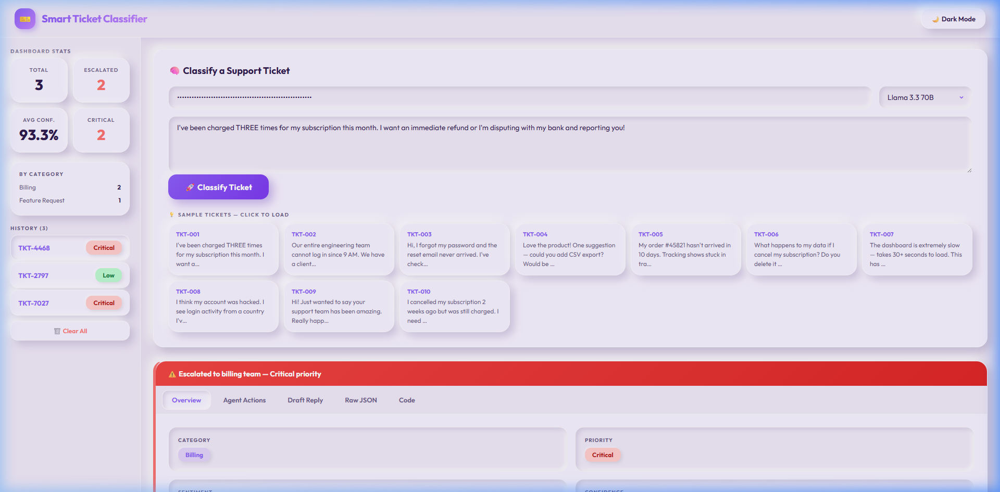

# 🎫 Smart Support Ticket Classifier

An **AI-powered, multi-stage agentic pipeline** that classifies customer support tickets and automatically takes intelligent actions using **function calling** capabilities.

## 📸 Demo



## What Makes This Different

Most ticket classifiers are simple AI wrappers. This project implements a **two-stage agentic pipeline**:

```
Ticket Input
    ↓
[Stage 1] Classifier Agent
    → category, priority, sentiment, confidence, keywords
    ↓
[Stage 2] Action Agent (Function Calling)
    → Tool: auto_respond(draft_reply)        ← drafts customer reply
    → Tool: escalate_ticket(team, reason)    ← routes to human if needed
    → Tool: tag_ticket(tags[])               ← adds CRM tags
    → Tool: set_sla_deadline(hours)          ← sets resolution deadline
    ↓
[Stage 3] Result
    → Full structured ticket object
    → Displayed on React dashboard
```

## 🚀 Quick Start

### Option 1: Docker (One Command)

```bash
git clone https://github.com/janarthvasan-0105/smart-ticket-classifier.git
cd smart-ticket-classifier
docker-compose up --build
```

- **Frontend:** http://localhost:3000
- **Backend API:** http://localhost:8000
- **API Docs:** http://localhost:8000/docs

### Option 2: Local Development

```bash
# 1. Install Python dependencies
cd backend
pip install -r requirements.txt

# 2. Start the backend server
uvicorn main:app --reload --port 8000

# 3. Serve the frontend (in a new terminal)
cd frontend
python -m http.server 3000
```

Then open http://localhost:3000 and enter your **free Groq API key** (get one at [console.groq.com](https://console.groq.com)).

## 📡 API Endpoints

| Method | Endpoint | Description |
|--------|----------|-------------|
| `GET` | `/` | Health check |
| `POST` | `/classify` | Classify a ticket (full agentic pipeline) |
| `GET` | `/tickets` | List all classified tickets |
| `GET` | `/tickets/{id}` | Get a single ticket |
| `GET` | `/samples` | Get 10 sample tickets for demo |
| `GET` | `/stats` | Dashboard statistics |
| `DELETE` | `/tickets` | Clear all tickets |

### Example Request

```bash
curl -X POST http://localhost:8000/classify?model=llama-3.3-70b-versatile \
  -H "Content-Type: application/json" \
  -H "X-Openai-Key: gsk-your-groq-key" \
  -d '{"message": "I have been charged twice this month!", "ticket_id": "TKT-042"}'
```

## 🏗️ Architecture

```
┌─────────────────────────────────────────────────────┐
│                    FRONTEND                         │
│         React SPA (CDN, no build step)              │
│  ┌──────────┐  ┌───────────┐  ┌──────────────┐      │
│  │  Stats   │  │ Classify  │  │   Result     │      │
│  │  Panel   │  │  Panel    │  │   Panel      │      │
│  └──────────┘  └───────────┘  └──────────────┘      │
└────────────────────┬────────────────────────────────┘
                     │ REST API (JSON)
┌────────────────────▼────────────────────────────────┐
│                   BACKEND (FastAPI)                 │
│  ┌────────────────────────────────────────────┐     │
│  │          TicketClassifierAgent             │     │
│  │  ┌─────────────┐    ┌──────────────────┐   │     │
│  │  │  Stage 1:   │    │   Stage 2:       │   │     │
│  │  │  Classify   │──▶│   Action Agent   │   │     │
│  │  │  (JSON)     │    │   (Tool Calling) │   │     │
│  │  └─────────────┘    └──────────────────┘   │     │
│  └────────────────────────────────────────────┘     │
│            │                    │                   │
│     ┌──────▼──────┐    ┌───────▼───────┐            │
│     │   Models    │    │    Tools      │            │
│     │  (Pydantic) │    │  (4 functions)│            │
│     └─────────────┘    └──────────────┘             │
└─────────────────────────────────────────────────────┘
                     │
              ┌──────▼──────┐
              │  Groq API   │
              │ Llama 3.3   │
              └─────────────┘
```

## 🛠️ Tech Stack

| Component | Technology |
|-----------|-----------|
| Backend | Python 3.12, FastAPI, Pydantic v2 |
| AI/ML | Groq API, Llama 3.3 70B, Function Calling |
| Frontend | React 18 (CDN), Claymorphism CSS |
| Deployment | Docker, Docker Compose, Nginx |

## 📋 Features

- **Two-stage AI pipeline** — classification + autonomous action execution
- **4 parallel tool calls** — auto-respond, escalate, tag, set SLA
- **10 sample tickets** — instant demo without typing
- **Real-time stats** — priority/category breakdown, escalation count
- **5-tab result view** — Overview, Agent Actions, Draft Reply, Raw JSON, Code
- **Dark mode** — toggle between light and dark themes
- **Claymorphism UI** — modern puffy 3D design with soft shadows
- **Copy buttons** — one-click copy for draft replies and code snippets
- **Priority color coding** — visual urgency indicators
- **Escalation alerts** — prominent banner for escalated tickets

---

*Built as an AI agent interview task demonstration — showcasing function calling, agentic pipelines, and full-stack development.*


